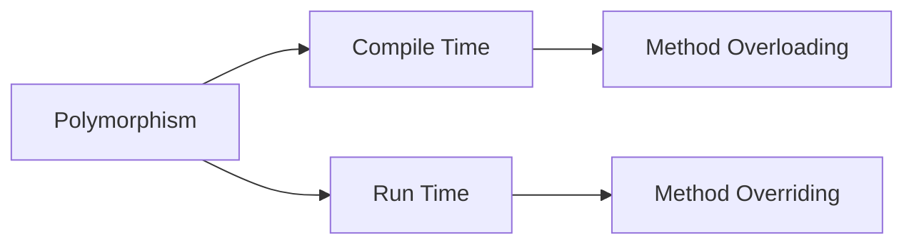
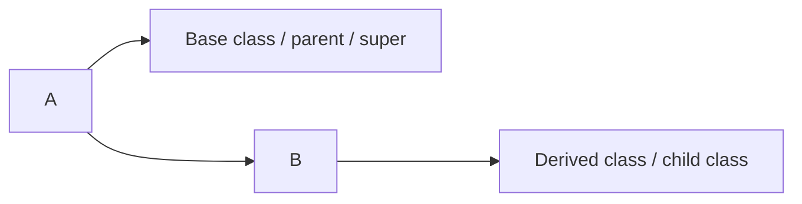
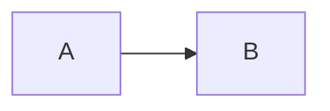
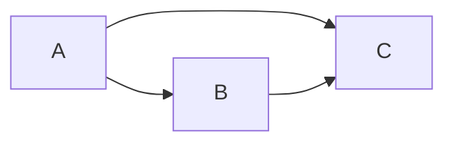
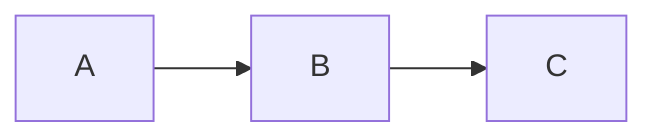
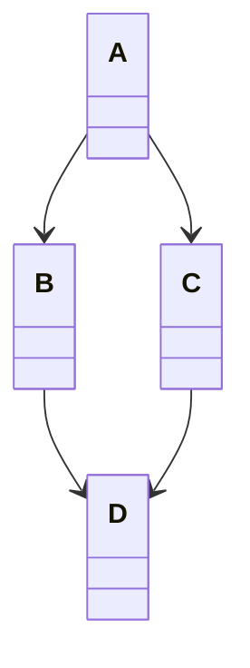
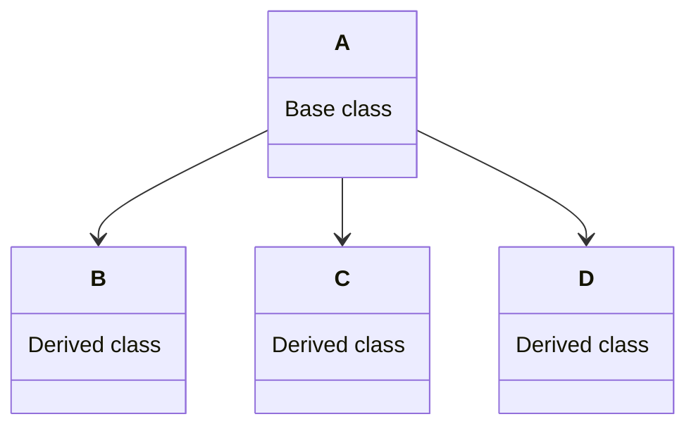

(8/22/2023)

balaguruswamy, Behrouz A. Forouzan -- books

# A. PROGRAMMING LANGUAGES
 **Role Of Programming Languages:**

 P.L. is a tool for instructig machines. They are notations, used for specifying organizing and reasoning about computations. The Language should :
1. Making the computation convenient for people.
2. Making efficient use of computation machine 
3. Universal - ie should have relation with natural languages
4. Portable - i.e. machine indepedent
5. Verifiable and understandable  

**Evolution of Programming Languages:**
 * Machine Lang : It is the native language of a computer It is the notation to which the computer responds directly. It consists of series of 0's and 1's to represent an insturction so the programs in machine lang. are unintelligible 

 * Assembly Lang : It is written in a low-level programming lang. consist of symbolic instruction. Each symbolic instruction is called mnemonnics, which is corresponding to a

# Procedural Programming VS Object-Oriented Progrmming 

Below are some of the differences between procedural and object-oriented programming:

|Procedural Oriented Programming | Object-Oriented Programming|
|--------------------------------|----------------------------|
|In procedural programming, the program is divided into small parts called FUNCTIONS| In OOP, the program is divided into small parts called OBJECTS.|
| Procedural Programming follows a top-down approach| It follows bottom-up approach|
| There is no access specifier in Procedural programming.| OOP has access specifiers like private, public, protected, etc,|
| Less Secure | More secure   |
| There is no data hiding and inheritance | Concept of data hiding and inheritance is used|
| The function is more important than a data| Data is more important than function|
| It is based on the unreal world | It is based on the real world|
| It is used for designing medium-sized programs| It is used for designing large-sized programs|

# Constructor 
* Constructor is a special member function in a class whose name is exactly same with the name of the class.
* It does not have any written type not even void.
* Contructor get automatically envoked or called within main function when object of that class is created 
* The scope of constructor should always be public
* It is automatically called whne object is created

### Types of Constructor:
1. Default Constructor
2. Paramatrcized
3. Copy Constructor

```cpp
//Assignmnt_5_A
#include<iostream>
#include<conio.h>
using namespace std;
class A{
    public:
        A(){
            i = 10;
            cout<<"i = "<< i;
        }

    void display(){
        cout<<"This is another member function of the class";
    }
};
int main(){
    A a1[5];
    for(int i = 0; i<5; i++>){
        a1.display();
    }
    
    return 0;
}
```


(08/24/2023)

**2. Parametricized Constuctor :**
In C++, a parameterized constructor is a constructor that accepts one or more parameters when an object of a class is instantiated. This allows you to initialize the object with specific values during creation. Parameterized constructors are particularly useful when you want to ensure that objects of your class are created in a valid and initialized state
```cpp
#include<iostream>
#include<conio.h>
using namespace std;
class A{
    public:
        A(int i){
            a = i;
            cout<<"This is the constructor (default)";
            cout<<"a = "<< a;
        }
        display(){
            cout<<"i =">>i;
        }
};
int main(){
    A a1[10];
    a1.display()
    
    return 0;
}
```

(29/08/2023)
 
* Scope Resolution Operator ( :: )

**3. Copy Constructor :**
It is a member function that initiaizes an object using another object of the same class.
A constructor which creates an object by initializing it with an object of te same class, which has been created previously is known as copy Constructor.

Usage: 
1. It is used to initialize members of newly created object by copying the members of an already nexisting object. It take a reference to n object of same class as n argument
```cpp
class MyClass {
public:
    // Copy constructor declaration
    MyClass(const MyClass& other) {
        // Copy the contents of 'other' to the current object
        // You can perform deep or shallow copying here as needed
    }
    
    // Rest of the class definition
};
```

(1/9/2023)

# Polymorphism 

Plymorphism is another OOPS concept which means having many forms.

**Types:**
1. Compile Time Polymorphism 
* Code associated at the time of compilation.
* Compile time polymorphism is implemented through function overloading and run time polymorphism is implemented thorugh method overriding.
* Ex: Function / Method overloading.


2. Run Time Polymorphism 
* Code associated at the run time.
* Function overloading meas a single class may contain more than one function definiion witht the same name but they should differ in their parameters.
* Ex: Method Overriding

(5/9/2023)


**Constructor Overloading :**
We are defining the many constructor in a class which has same name but different parameter.
```cpp
class Add{
    public:
    Add(){  }
    Add(int i, int j){  }
    Add(float f1, f2){   }
};
int main(){
Add a1;
Add a2(10,20);
Add a3(1.2,2.4);
}

```
(7/9/2023)

**Operator Overloading:**
It is a phenomene in which we are giving extra task to the operator.
```cpp
public:
***********
 returnType operator symbol (arguments){
    *******
 }
***********
```

(8/9/2023)

**Unary operator:** operates on a single operand only : preefix, post-fix, increment, decreement.

**Binary operator:** operatos on two operand,.

(12/9/2023)

Which are the operators in c++ that can never be overloaded and why?

=> In C++, there are a few operators that cannot be overloaded. These operators are:
1. **::** (Scope Resolution Operator): This operator is used to define the scope of a function or variable. It cannot be overloaded because overloading it would interfere with the basic language syntax.

2. **.** (Member Access Operator): This operator is used to access the members of a class or structure. It cannot be overloaded because it would lead to ambiguity and confusion.

3. *.** (Pointer to Member Operator): This operator is used to access a member through a pointer. Like the dot operator, it cannot be overloaded for similar reasons.

4. **?:** (Conditional Operator): This operator is used for conditional expressions. It cannot be overloaded because it has a specific, built-in behavior that would be difficult to replicate through overloading.

5. **sizeof**: This operator is used to determine the size of a data type or variable. It cannot be overloaded because it is a compile-time operator, and overloading it would require runtime behavior.

6. **typeid**: This operator is used for obtaining type information at runtime. It cannot be overloaded because it is a language feature that relies on specific compiler support.

7. **const_cast**: This operator is used for type casting away constness. Overloading it would lead to potential type safety issues.

8. **dynamic_cast**: This operator is used for performing safe downcasting in a class hierarchy. It relies on the runtime type information (RTTI) system, and overloading it could lead to unsafe behavior.

9. **reinterpret_cast**: This operator is used for low-level casting between pointer types. Overloading it could lead to unsafe type conversions.

10. **typeid**: This operator is used to get type information at runtime. It cannot be overloaded because it is a language feature and not a user-defined function.

These operators are either fundamental to the language's syntax and semantics or rely on specific compiler features, making them unsuitable for overloading. Attempting to overload these operators would likely lead to ambiguous behavior or conflicts with the language's built-in functionality.

## Inheritance:

```cpp
class A {
    * * * * 
};
class B : public  A // Here we are inheriting the elements of class A to B
{
     * * * *
};
```

1. Private
2. Public
3. Protected = members are only accessible to the next derived class `only`.

**Types of Inheritance:**
1. Single Inheritance 

2. Multiple inheritance

3. Multilevel inheritance 

4. Hybrid Inheritance 

5. Hierarchical Inheritance

